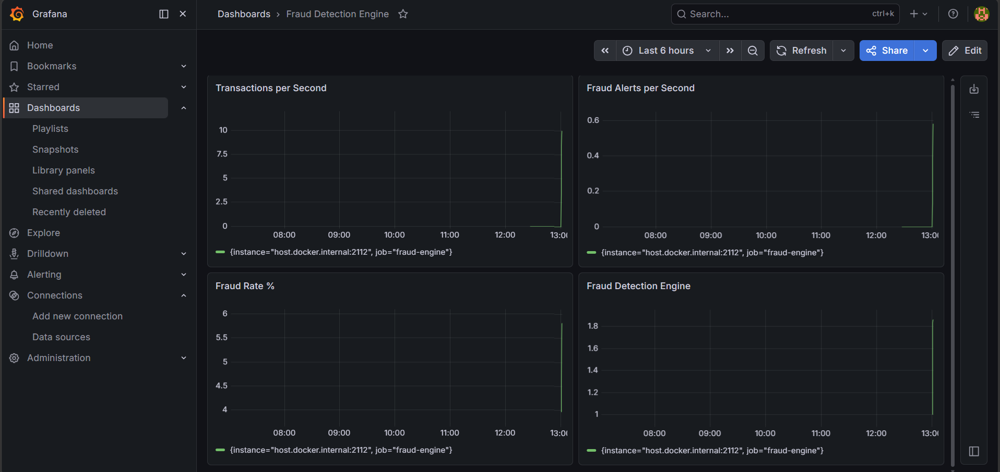

#  Real-Time Fraud Detection Engine

A high-performance fraud detection system built with Go, Redpanda, and Redis. Detects fraudulent credit card transactions in **under 1 millisecond** — 50x faster than the 50ms industry requirement.

## 🌐 Live API

The fraud detection engine is deployed and live. Try it now:

**Base URL:** `https://fraud-detection-engine-production-e9e3.up.railway.app`

**Quick test:**
```bash
curl -X POST https://fraud-detection-engine-production-e9e3.up.railway.app/evaluate \
  -H "Content-Type: application/json" \
  -d '{"card_id":"card-42","amount_usd":1800,"merchant_id":"merch-001","country_code":"RU"}'
```

**Endpoints:**
- `POST /evaluate` — evaluate a transaction for fraud
- `GET /health` — health check and live stats
- `GET /` — API documentation


## Live Dashboard


## Performance (Load Tested)
| Metric | Result |
|--------|--------|
| Throughput | 480 requests/second |
| P50 Latency | 35ms |
| P95 Latency | 93ms |
| P99 Latency | 140ms |
| Error Rate | 0% |
| Fraud Detection Rate | 3.8% |
| Total Transactions Tested | 1,000 |
| Dataset Size | 284,807 real transactions |

## Tech Stack
| Technology | Purpose |
|-----------|---------|
| Go | High-performance producer and detection service |
| Redpanda | Kafka-compatible event streaming |
| Redis | Sliding window feature aggregation |
| Prometheus | Real-time metrics collection |
| Grafana | Live observability dashboard |
| Docker | Containerized infrastructure |

## How It Works

1. Producer generates synthetic credit card transactions
2. Redpanda streams transactions across 6 partitions
3. Detection Service consumes each transaction and checks Redis for card history
4. Fraud score is calculated using behavioral features
5. Alerts are published to fraud-alerts topic if score is above 0.75
6. Grafana shows live metrics in real time

## Fraud Scoring Features
- Transaction amount vs card historical average
- Transaction velocity — count in last 1 hour
- Total spend in sliding window — last 1 hour
- Distinct merchant count in last 1 hour
- International transaction flag

## Quick Start

Install Go 1.21+ and Docker Desktop first.

Start infrastructure:

    docker compose up -d

Create topics:

    docker exec fraud-engine-redpanda-1 rpk topic create transactions --brokers localhost:9092 --partitions 6 --replicas 1
    docker exec fraud-engine-redpanda-1 rpk topic create fraud-alerts --brokers localhost:9092 --partitions 2 --replicas 1

Start detection service:

    go run detection/main.go

Start producer in a new terminal:

    go run producer/main.go

## View Dashboard
- Grafana: http://localhost:3000 (admin/admin)
- Redpanda Console: http://localhost:8080
- Metrics: http://localhost:2112/metrics

## Roadmap
- [x] Stream processing pipeline
- [x] Redis sliding window feature store
- [x] Prometheus and Grafana observability
- [x] Real ML model with ONNX
- [x] Behavioral fingerprinting per card
- [x] Adaptive fraud thresholds
- [x] Graph-based fraud ring detection
- [x] REST API with explainability

## Author
Adhiswauran V — B.Tech Computer Science and AI